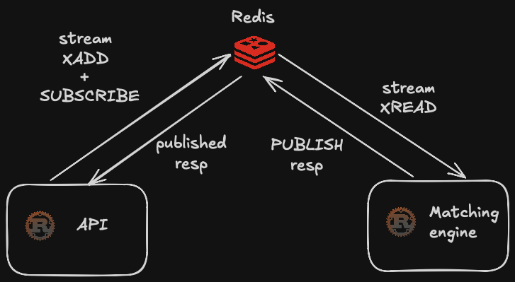

# matching-engine

A centralized exchange (CEX) backend, built from scratch in Rust — a price-time
matching engine, an accounts ledger, a REST API with JWT auth, an in-memory
order-book projection, and a Postgres-backed trade/order history — all wired
together over durable Redis Streams.

This is a learning project first: the goal is to get fluent in Rust and in the
distributed-systems ideas that make a real exchange correct (determinism,
replay, at-least-once delivery, conservation of funds), while ending up with
something end-to-end and demoable.

For the full design reasoning — every architectural decision and *why* it was
made that way — see [`ARCHITECTURE.md`](./ARCHITECTURE.md). **Note:**
`ARCHITECTURE.md` currently only covers the M0–M5 foundation (engine, ledger,
transport) and is out of sync with everything below M6 onward; the up-to-date
decision log lives in a local, gitignored `DESIGN.md`. This README is the quick
tour of what's actually built and runnable today.

## Status

Actively being built, milestone by milestone. Currently:

- ✅ Price-time matching engine (limit + market orders, partial fills, FIFO)
- ✅ Accounts ledger (available/reserved balances, reserve → settle → refund → release)
- ✅ Multiple trading pairs — one order book per market, engine-global order ids,
  a cancel resolves its own market/currency (never trusts the client for it)
- ✅ Three-process architecture: `api`, `engine`, `db_writer`, decoupled via Redis
  - Commands (`Place`, `Cancel`, `Deposit`, `Withdraw`) flow in through a durable
    Redis Stream, one entry per command
  - Results flow back through Redis pub/sub, correlated by UUID
  - The engine emits one `EventBatch` (all of a command's events, engine-assigned
    `seq`) per command onto a second durable Stream — `db_writer` applies each
    batch inside one Postgres transaction, so a trade's rows are never visible
    half-written
- ✅ Crash recovery (silent replay of the command log to a boundary, then live)
- ✅ REST API + JWT auth (`/auth/signup`, `/auth/login`), idempotency via a
  required `X-Client-Order-Id` header on every write
- ✅ Full order lifecycle: `POST /orders`, `DELETE /orders/:id` (ownership
  enforced by the engine), `POST /deposits`, `POST /withdrawals`
- ✅ Account-scoped reads off the Postgres projection: `GET /balances`, `GET /orders`
- ✅ Order fill tracking (`filled_qty`, `open`/`partially_filled`/`filled`/`cancelled`)
- ✅ In-memory order-book projection per API process, fed by the event stream,
  with `GET /book/:pair` (price-level snapshot + a sequence number for
  snapshot/delta reconciliation)
- ✅ WebSocket feeds, both fed by the same tail that drives the book
  projection (one Redis connection, fanned out over a `broadcast` channel):
  - `GET /ws/market/:pair` — public book deltas + trade tape, no auth, one
    connection per pair, each message tagged with the sequence number to
    reconcile against a `GET /book/:pair` snapshot
  - `GET /ws/orders` — private per-account order updates
    (`OrderAccepted`/`OrderUpdated`). No `Authorization` header on a
    websocket upgrade (browsers can't set one), so auth is a first-message
    handshake: the client's first frame must be `{"token": "<jwt>"}`
- ✅ Listed-pairs whitelist — no pair is tradeable until an admin lists it via
  `POST /admin/pairs`/`DELETE /admin/pairs/:pair`, gated by the
  `ADMIN_ACCOUNT_ID` env var (not a full roles system — there's one admin
  action). Also: a bounded idempotency-key set (no longer unbounded memory
  growth), and an overflow guard on order value (`price * size`) checked once
  at placement rather than left to wrap around silently later.
- ⬜ Market-buy orders, latency benchmarks, observability,
  one-engine-per-pair horizontal scaling

## Architecture at a glance



*(Diagram predates `db_writer` and the book projection — see below for the
current shape.)*

- The **engine** is a single-threaded process that owns all state (order books,
  the ledger, dedup/idempotency state) exclusively. It reads commands off the
  `commands` Stream in order via a consumer group, applies them, publishes the
  correlated result, and emits one `EventBatch` per command onto the `events`
  Stream.
- The **api** process is stateless per-request. Handlers turn a request into a
  command, register a `oneshot` waiter, `XADD` the command, and await the
  reply — a single shared background task subscribes once and fans results out
  to whichever handler is waiting. It also runs an in-memory book projection:
  a background task tails `events` and maintains price-level aggregates purely
  in that process's memory (no network hop for a book read; scales for free
  with API instance count, since a plain `XREAD` — no consumer group — means
  every instance sees every event independently). That same tail task also
  fans every batch into a `broadcast` channel, which is what feeds the
  websocket handlers (`GET /ws/market/:pair`, `GET /ws/orders`) — one Redis
  connection, multiple readers of its output.
- **`db_writer`** consumes the same `events` Stream and projects trades,
  balances, and orders into Postgres, one Postgres transaction per command
  batch.
- Because the engine applies every command strictly in log order, replaying
  that log from the start always reconstructs the same state — the basis for
  crash recovery, and for a fresh `api`/`db_writer` instance bootstrapping its
  own projection.
- Every trade settles through the ledger's `available`/`reserved` balance
  split, with a conservation invariant enforced in tests (a trade moves money
  between accounts; it never creates or destroys it).

## Running it

Requires local Redis and Postgres:

```bash
docker run -d --name pg -e POSTGRES_PASSWORD=pw -e POSTGRES_DB=exchange -p 5432:5432 postgres:17
docker run -d --name redis -p 6379:6379 redis
```

A `.env` in the repo root with:

```
DATABASE_URL=postgres://postgres:pw@127.0.0.1:5432/exchange
JWT_SECRET=<any string>
ADMIN_ACCOUNT_ID=<account id allowed to list/delist trading pairs>
```

Run migrations, then each process in its own terminal:

```bash
sqlx migrate run
cargo run --bin engine
cargo run --bin db_writer
cargo run --bin api        # serves http://127.0.0.1:3000
```

Then, for example:

```bash
curl -X POST localhost:3000/auth/signup -H 'content-type: application/json' \
  -d '{"email":"me@x.com","password":"pw"}'
# -> {"token": "..."}

# No pair is tradeable until listed — use the account whose id matches
# ADMIN_ACCOUNT_ID (e.g. the first signup, id 1, on a fresh DB).
curl -X POST localhost:3000/admin/pairs \
  -H "Authorization: Bearer <admin token>" -H 'X-Client-Order-Id: 1' \
  -H 'content-type: application/json' -d '{"pair":"SOL-USD"}'

curl -X POST localhost:3000/orders \
  -H "Authorization: Bearer <token>" -H 'X-Client-Order-Id: 2' \
  -H 'content-type: application/json' \
  -d '{"pair":"SOL-USD","order_type":"Limit","side":"Bid","price":100,"size":10}'

curl localhost:3000/book/SOL-USD

# public feed — book deltas + trade tape for one pair, no auth
websocat ws://localhost:3000/ws/market/SOL-USD

# private feed — this account's order updates. First frame sent must be the
# auth message; the upgrade itself carries no credentials.
websocat ws://localhost:3000/ws/orders
> {"token":"<token>"}
```

You can also inspect the streams directly:

```bash
docker exec -it redis redis-cli
> XRANGE commands - +
> XRANGE events - +
```

## Tests

```bash
cargo test
```

52 unit tests: order book matching (fills, partial fills, FIFO, market
sweeps), cancellation and ownership, trade pricing, the ledger
(reserve/settle/refund/release, insufficient-funds rejection, conservation,
overflow rejection, multi-currency withdraw), multi-pair isolation,
fill-tracking/status transitions, the event-batch sequencing (seq assignment,
no-seq-for-no-op commands, book-delta dedup), the bounded dedup window, and
the listed-pairs whitelist (list/delist, idempotent re-listing, rejection
before listing and after delisting).

```bash
./scripts/smoke.sh
```

An end-to-end smoke test: brings up Redis/Postgres, runs migrations, starts
all three binaries, then drives the real HTTP API — signup/login, an order
that rests and one that crosses and fills, deposits, withdrawals,
ownership-checked cancellation, account-scoped reads, the book projection
(including a check that a resting order is visible in `GET /book` *before*
it's matched, not just absent at the end), and the two websocket feeds —
public book-delta delivery, the private first-message auth handshake
(both a bad token getting closed and a good one getting authenticated),
and that one account's private feed never sees another account's orders.
Also covers the listed-pairs whitelist: orders on an unlisted pair are
rejected, non-admin listing attempts are forbidden, and a pair becomes (and
stops being) tradeable exactly when listed/delisted.
Requires Node ≥ 22 (`scripts/ws_smoke.mjs`, invoked by `smoke.sh`, uses the
global `WebSocket` client) in addition to Redis/Postgres/`sqlx-cli`/`jq`.

## Project layout

```
src/
├── types.rs         # wire + domain types: Order, Trade, Pair, Command/CommandResponse,
│                     # Event/EventBatch, Engine/OrderBook, Ledger
├── engine.rs         # OrderBook (matching), Ledger, Engine (orchestration), apply(),
│                     # run_engine()/recover() (Redis loop + crash recovery), tests
├── lib.rs
└── bin/
    ├── engine.rs      # engine process: consumes `commands`, emits `events`
    ├── db_writer.rs   # projects `events` into Postgres (trades/balances/orders)
    └── api/
        ├── main.rs    # HTTP server: AppState, the correlation-flow helper, all handlers
        ├── auth.rs    # JWT sign/verify, argon2 hashing, AuthUser/ClientOrderId extractors
        ├── book.rs    # in-memory order-book projection + GET /book/:pair
        └── ws.rs      # GET /ws/market/:pair (public) + GET /ws/orders (private) handlers

migrations/            # sqlx migrations (users, trades, balances, orders)
scripts/smoke.sh        # end-to-end smoke test against the real running system
scripts/ws_smoke.mjs    # smoke.sh's websocket-feed helper (Node's global WebSocket)
```
